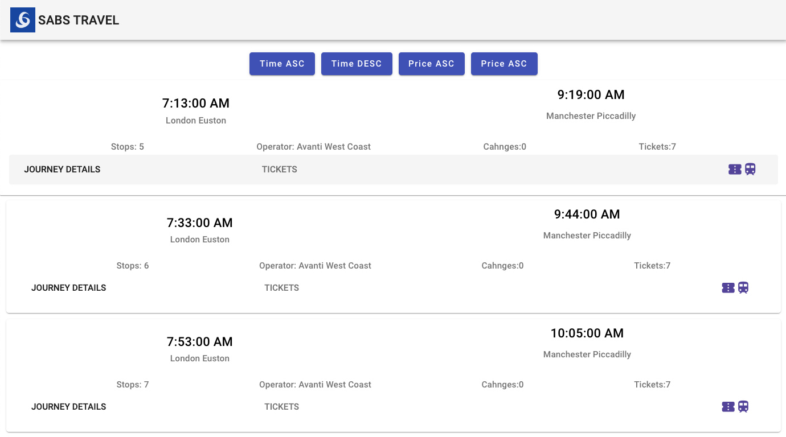

# SabsTravel

## Brief

- [x] Create a fresh Angular project to use

- [x] Create a single-page app.

- [x]  Load the rail results in the supplied results.json file, parse the json to get tickets , ticket prices, depart times , 
number of legs etc 

- [x]  Load the parsed results and display as a list of available tickets with useful info (price, time etc)  

- [x] Add a button that will toggle the tickets displayed by price/time.
 

How you do this is up to you.


---

 
### 📋 GET STARTED


```bash
git clone https://github.com/tom-kotlar/train-times.git
cd train-times
```


 
### 📀 NPM Install dependencies

   ```sh
    npm install
   ```

you will install Dependencies & node_modules folder: 

   ```bash
    @angular/animations: ^15.1.0,
    @angular/cdk: ^15.1.2,
    @angular/common: ^15.1.0,
    @angular/compiler: ^15.1.0,
    @angular/core: ^15.1.0,
    @angular/flex-layout: ^15.0.0-beta.42,
    @angular/forms: ^15.1.0,
    @angular/material: ^15.1.2,
    @angular/platform-browser: ^15.1.0,
    @angular/platform-browser-dynamic: ^15.1.0,
    @angular/router: ^15.1.0,
    rxjs: ~7.8.0,
    tslib: ^2.3.0,
    zone.js: ~0.12.0

   ```

 ### 💻 Local Server
  Local host server port: **http://localhost:4200/**

   ```bash
    npm run start
   ```


 
 ### 🖼️ User Stories

 - User is able to view Train Times for chosen day

   

- User is able to click on Journey Details and view Train Tickets

   

- User is able to sort Trains Times and Train Tickets

---

This project was generated with [Angular CLI](https://github.com/angular/angular-cli) version 15.1.4.

## Development server

Run `ng serve` for a dev server. Navigate to `http://localhost:4200/`. The application will automatically reload if you change any of the source files.

## Code scaffolding

Run `ng generate component component-name` to generate a new component. You can also use `ng generate directive|pipe|service|class|guard|interface|enum|module`.

## Build

Run `ng build` to build the project. The build artifacts will be stored in the `dist/` directory.

## Running unit tests

Run `ng test` to execute the unit tests via [Karma](https://karma-runner.github.io).

## Running end-to-end tests

Run `ng e2e` to execute the end-to-end tests via a platform of your choice. To use this command, you need to first add a package that implements end-to-end testing capabilities.

## Further help

To get more help on the Angular CLI use `ng help` or go check out the [Angular CLI Overview and Command Reference](https://angular.io/cli) page.
